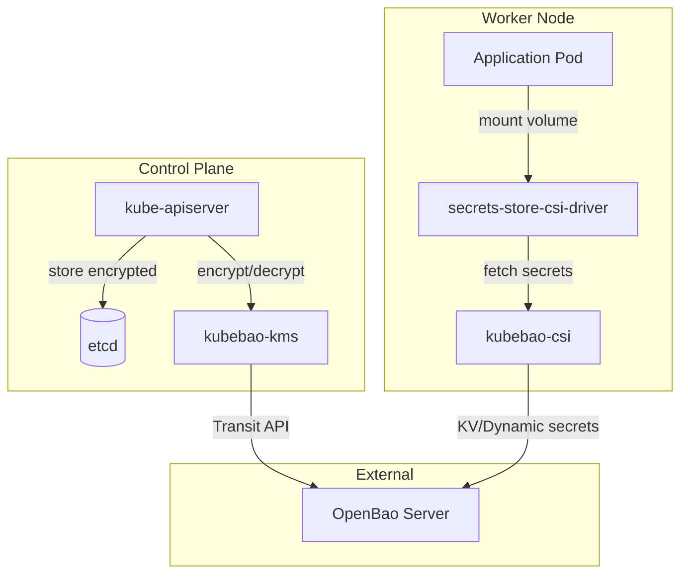

# План разработки KubeBao

## Архитектура решения

KubeBao состоит из трёх основных компонентов, работающих совместно:




## Компонент 1: kubebao-kms (KMS Plugin)

**Назначение**: Шифрование Kubernetes Secrets в etcd через OpenBao Transit secrets engine.

**Реализация**:

- gRPC сервер, реализующий `k8s.io/kms/apis/v2.KeyManagementServiceServer`
- Три метода: `Status()`, `Encrypt()`, `Decrypt()`
- Использует OpenBao Transit API для envelope encryption
- Запускается как static pod на control plane nodes

**Ключевые файлы**:

- `cmd/kubebao-kms/main.go` - точка входа
- `internal/kms/server.go` - gRPC сервер
- `internal/kms/transit.go` - клиент OpenBao Transit
- `internal/kms/config.go` - конфигурация

**Конфигурация Kubernetes API Server**:

```yaml
apiVersion: apiserver.config.k8s.io/v1
kind: EncryptionConfiguration
resources:
  - resources: [secrets]
    providers:
      - kms:
          apiVersion: v2
          name: kubebao
          endpoint: unix:///var/run/kubebao/kms.sock
```

## Компонент 2: kubebao-csi (CSI Provider)

**Назначение**: Динамическая инъекция секретов из OpenBao в поды через Secrets Store CSI Driver.

**Реализация**:

- gRPC сервер, реализующий `sigs.k8s.io/secrets-store-csi-driver/provider/v1beta1.CSIDriverProviderServer`
- Поддержка всех OpenBao secrets engines (KV, database, PKI, и др.)
- Аутентификация через Kubernetes ServiceAccount (JWT)
- Автоматическое обновление секретов при ротации

**Ключевые файлы**:

- `cmd/kubebao-csi/main.go` - точка входа
- `internal/csi/provider.go` - CSI provider
- `internal/csi/auth.go` - аутентификация в OpenBao
- `internal/csi/secrets.go` - получение секретов

**Пример SecretProviderClass**:

```yaml
apiVersion: secrets-store.csi.x-k8s.io/v1
kind: SecretProviderClass
metadata:
  name: kubebao-secrets
spec:
  provider: kubebao
  parameters:
    roleName: "my-app"
    objects: |
      - objectName: "db-password"
        secretPath: "secret/data/myapp/db"
        secretKey: "password"
```

## Компонент 3: kubebao-operator (Kubernetes Operator)

**Назначение**: Автоматизация управления жизненным циклом секретов и политик OpenBao.

**CRD (Custom Resource Definitions)**:

**BaoSecret** - декларативное определение секретов:

```yaml
apiVersion: kubebao.io/v1alpha1
kind: BaoSecret
metadata:
  name: my-app-secrets
spec:
  secretPath: "secret/data/myapp"
  target:
    name: my-app-secret
    namespace: default
  refreshInterval: 1h
```

**BaoPolicy** - управление политиками OpenBao:

```yaml
apiVersion: kubebao.io/v1alpha1
kind: BaoPolicy
metadata:
  name: my-app-policy
spec:
  rules:
    - path: "secret/data/myapp/*"
      capabilities: [read, list]
```

**Ключевые файлы**:

- `cmd/kubebao-operator/main.go` - точка входа
- `internal/controller/baosecret_controller.go` - контроллер BaoSecret
- `internal/controller/baopolicy_controller.go` - контроллер BaoPolicy
- `api/v1alpha1/` - CRD definitions

## Структура проекта

```
kubebao/
├── cmd/
│   ├── kubebao-kms/
│   │   └── main.go
│   ├── kubebao-csi/
│   │   └── main.go
│   └── kubebao-operator/
│       └── main.go
├── internal/
│   ├── kms/
│   │   ├── server.go
│   │   ├── transit.go
│   │   └── config.go
│   ├── csi/
│   │   ├── provider.go
│   │   ├── auth.go
│   │   └── secrets.go
│   ├── controller/
│   │   ├── baosecret_controller.go
│   │   └── baopolicy_controller.go
│   └── openbao/
│       └── client.go
├── api/
│   └── v1alpha1/
│       ├── baosecret_types.go
│       ├── baopolicy_types.go
│       └── groupversion_info.go
├── charts/
│   └── kubebao/
│       ├── Chart.yaml
│       ├── values.yaml
│       └── templates/
├── config/
│   ├── crd/
│   ├── rbac/
│   └── samples/
├── Dockerfile
├── Makefile
├── go.mod
└── README.md
```

## Helm Chart

Единый Helm chart с возможностью включения/выключения компонентов:

```yaml
# values.yaml
global:
  openbao:
    address: "https://openbao.example.com:8200"
    authMethod: kubernetes
    role: kubebao

kms:
  enabled: true
  socketPath: /var/run/kubebao/kms.sock
  transitKeyName: kubebao-kms
  
csi:
  enabled: true
  driver:
    install: true  # установить secrets-store-csi-driver
  
operator:
  enabled: true
  crds:
    install: true
```

## Зависимости (go.mod)

```go
module github.com/kubebao/kubebao

go 1.22

require (
    github.com/openbao/openbao/api/v2 v2.5.0
    google.golang.org/grpc v1.77.0
    k8s.io/kms v0.35.0
    k8s.io/api v0.35.0
    k8s.io/apimachinery v0.35.0
    k8s.io/client-go v0.35.0
    sigs.k8s.io/secrets-store-csi-driver v1.5.5
    sigs.k8s.io/controller-runtime v0.19.0
)
```

## Порядок разработки

### Фаза 1: Базовая инфраструктура

- Инициализация Go модуля и структуры проекта
- Общий клиент OpenBao (`internal/openbao/client.go`)
- Базовый Makefile и Dockerfile

### Фаза 2: KMS Plugin

- Реализация KMS v2 gRPC сервера
- Интеграция с OpenBao Transit API
- Тесты и конфигурация для kube-apiserver

### Фаза 3: CSI Provider

- Реализация CSI Provider gRPC сервера
- Поддержка Kubernetes auth в OpenBao
- Интеграция с Secrets Store CSI Driver

### Фаза 4: Operator

- Определение CRD (BaoSecret, BaoPolicy)
- Реализация контроллеров
- Reconciliation logic для синхронизации

### Фаза 5: Helm Chart и документация

- Полноценный Helm chart со всеми компонентами
- Примеры использования
- README и документация

## Ключевые особенности решения

**Революционность подхода**:

- Единственное решение, объединяющее KMS encryption и CSI dynamic secrets
- Полная интеграция с OpenBao (открытая альтернатива Vault)
- Декларативное управление через CRD
- Простое развёртывание одной командой Helm

**Преимущества перед существующими решениями**:

- Trousseau: только KMS, нет динамических секретов
- Vault CSI Provider: только CSI, нет KMS encryption
- KubeBao: оба подхода + Kubernetes Operator для автоматизации

